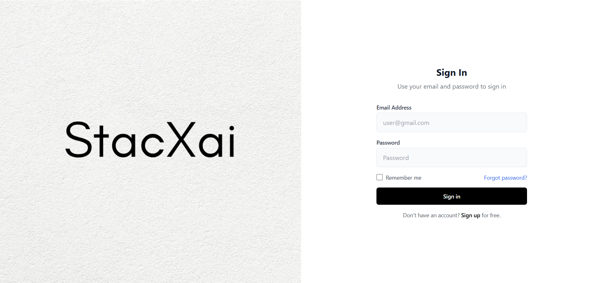
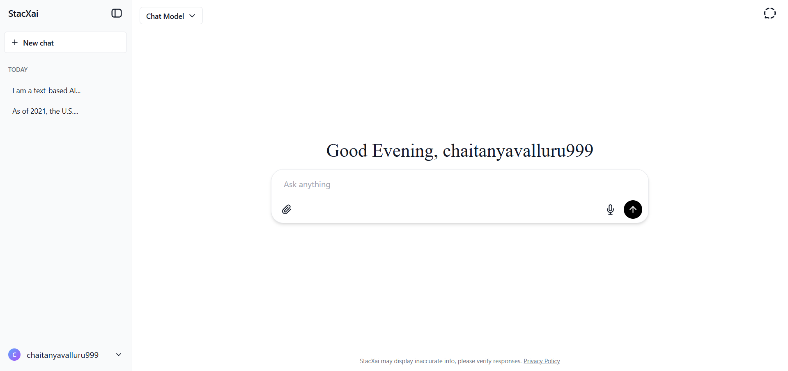

# 🚀 AI ChatBot – StacXai

An intelligent, interactive chat interface built with **Next.js**, powered by **OpenRouter's Mistral-7B-Instruct** model for real-time natural language conversations. Designed with a sleek UI and secure API integration, this app demonstrates scalable AI deployment in production-ready environments and deployed into netfiy.

---

## 🖼️ UI Screenshots

### 🔐 Sign In Page

### 💬 Chat Interface

> 📁 _You can save these screenshots in your repo under `public/assets/screenshots/` and update paths accordingly._

---

## ⚙️ Features

- ✨ Sleek, responsive UI with modern UX
- 🔐 Secure user authentication
- 🤖 Integrated **Mistral-7B-Instruct** model via OpenRouter
- 🔄 Chat history & context-aware messaging
- 🛡️ Secure API key management via environment variables
- 🔍 Health check endpoint for API monitoring
- 🔁 Real-time message handling with error feedback

---

## 🧠 Tech Stack

- **Frontend**: Next.js 14 (App Router), TypeScript
- **LLM API**: [OpenRouter](https://openrouter.ai/)
- **Model Used**: `mistral-7b-instruct`
- **UI Framework**: Tailwind CSS, Geist Font (via `next/font`)
- **Authentication**: Email/password (custom or Firebase/AuthJS)

---

🛠️ Getting Started
1. Clone the Repository
bash
Copy
Edit
git clone https://github.com/Chaitanya-Krish147/Ai-ChatBot.git
cd Ai-ChatBot

2. Install Dependencies
bash
Copy
Edit
npm install
or
yarn install

3. Configure Environment Variables
Create a .env.local file:

env
Copy
Edit
OPENROUTER_API_KEY=your_openrouter_api_key
🔒 Never hard-code API keys in source files. Use .env.local.

4. Run the App
bash
Copy
Edit
npm run dev
Visit http://localhost:3000 in your browser.

📡 API Endpoints
🔹 POST /api/chat
Purpose: Handles LLM prompt completions

Request Body:

json
Copy
Edit
{
  "messages": [
    { "role": "user", "content": "Hello!" }
  ]
}
Response:

json
Copy
Edit
{
  "response": "Hi! How can I assist you today?"
}
🔹 GET /api/health
Purpose: Basic API status check

Response:

json
Copy
Edit
{ "status": "ok" }
🧑‍💻 LLM Integration Highlights
✅ Integrated OpenRouter API with Mistral-7B-Instruct for advanced NLP

🔐 Managed API keys securely with .env and environment-based configs

🔄 Designed chat completion handler with robust error feedback

🧪 Built /health endpoint for deployment health checks

📊 Logged errors and responses for debugging and performance tracking

🚀 Deployment
Deploy seamlessly to Vercel with GitHub integration.

Push your repo to GitHub

Connect to Netify

Set environment variables

Deploy 🚀

📚 Learn More
Next.js Documentation

OpenRouter API

Mistral-7B-Instruct Model Info

👤 Author
Chaitanya Krishna
